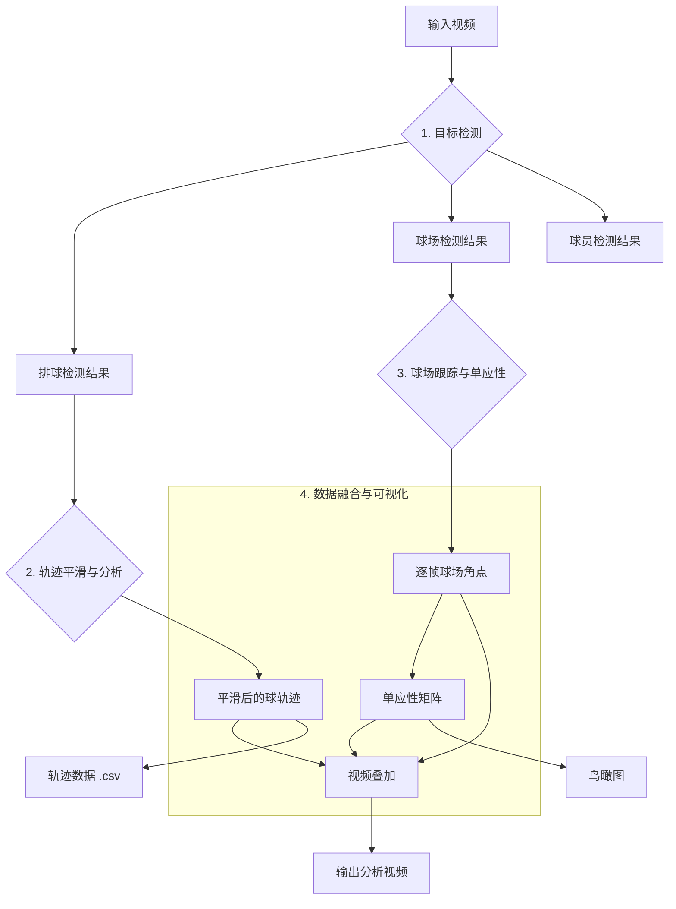

# 🏐 Volleyball Visual Analysis

一个基于计算机视觉的排球视频分析工具集，能够自动完成 **目标检测**、**轨迹跟踪** 和 **战术分析**。

本工具通过 [Roboflow](https://roboflow.com/) 的强大模型进行推理，结合卡尔曼滤波、光流法等多种技术，实现了对排球、球员和球场的高精度分析，并能将结果可视化地叠加到原视频中。

---

## ✨ 核心功能

- **多目标检测与跟踪**:
  - **排球**: 毫秒级精准检测，并利用 Viterbi 算法和卡尔曼滤波生成平滑的运动轨迹。
  - **球场**: 稳定识别球场边界，并通过单应性变换生成鸟瞰图。
  - **球员**: 检测场上所有球员，并可进一步进行号码识别或动作分析。
- **轨迹与物理分析**:
  - 将像素坐标转换为真实的球场坐标（米）。
  - 计算球的速度、加速度等物理量。
- **高度可定制化**:
  - 所有关键参数均可通过 `.env` 文件配置。
  - 模块化设计，方便扩展或替换算法。
- **强大的可视化**:
  - 将检测框、轨迹线、球场边界等信息实时绘制到视频上。
  - 支持生成迷你鸟瞰图，直观展示场上动态。

---

## 🚀 快速上手

只需三步，即可完成一次完整的视频分析。

### 1. 环境准备

```bash
# 克隆项目
git clone https://github.com/your-repo/VolleyballVisualAnalysis.git
cd VolleyballVisualAnalysis

# 创建并激活虚拟环境
python3 -m venv .venv
source .venv/bin/activate

# 安装依赖
pip install -r requirements.txt
```

### 2. 配置环境

在项目根目录创建一个 `.env` 文件，并填入你的 Roboflow API 密钥。

```
ROBOFLOW_API_KEY="YOUR_ROBOFLOW_API_KEY"
```

同时，将你的排球比赛视频命名为 `input.mp4` 并放置在 `data/` 目录下。

### 3. 运行完整流程

执行以下命令，一键完成从检测到可视化叠加的全部流程：

```bash
# 依次执行球检测、球场检测、轨迹分析和视频叠加
python3 scripts/run_detection.py ball
python3 scripts/run_detection.py court
python3 scripts/run_court_processing.py
python3 scripts/run_trajectory_analysis.py
python3 scripts/run_overlay.py
```

分析完成后，你将在 `outputs/` 目录下找到最终的叠加视频 `ball_overlay_full.mp4` 以及其他分析数据。

---

## 📊 工作流程

本项目的数据处理流程如下图所示：



---

## 🛠️ 详细用法

### 检测模块 (`scripts/run_detection.py`)

此脚本用于调用 Roboflow模型 对视频进行目标检测。

- **检测排球**:
  ```bash
  python3 scripts/run_detection.py ball
  ```
- **检测球场**:
  ```bash
  python3 scripts/run_detection.py court
  ```
- **检测球员**:
  ```bash
  python3 scripts/run_detection.py players
  ```

### 分析与处理模块

- **处理球场数据** (平滑、插值):
  ```bash
  python3 scripts/run_court_processing.py
  ```
- **计算单应性并生成鸟瞰图**:
  ```bash
  python3 scripts/run_court_homography.py
  ```
- **分析球的轨迹** (转换为世界坐标):
  ```bash
  python3 scripts/run_trajectory_analysis.py
  ```

### 可视化模块

- **生成最终叠加视频**:
  ```bash
  python3 scripts/run_overlay.py
  ```
- **预览球场跟踪效果**:
  ```bash
  python3 scripts/preview_court_tracking.py
  ```

---

## ⚙️ 主要配置项

通过修改根目录的 `.env` 文件，你可以调整项目的各项参数。

| 变量名 | 描述 | 默认值 |
| :--- | :--- | :--- |
| `ROBOFLOW_API_KEY` | **必需**，你的 Roboflow API 密钥 | `None` |
| `VIDEO_PATH` | 输入视频的路径 | `data/input.mp4` |
| `INFER_FPS` | 检测时视频的抽帧率 | `12` |
| `OVERLAY_MIN_CONF` | 叠加时显示的最小置信度 | `0.1` |
| `COURT_OVERLAY` | 是否在视频中叠加球场 | `True` |
| `COURT_MINI_ENABLE`| 是否启用迷你鸟瞰图 | `True` |

---

## 📁 项目结构

```
.
├── actions/      # 动作分析模块
├── analysis/     # 轨迹平滑、滤波等核心分析算法
├── ball/         # 排球检测与轨迹构建管线
├── config/       # 项目配置文件加载
├── core/         # 核心工具类（如 Roboflow 客户端）
├── court/        # 球场检测、跟踪与单应性计算
├── players/      # 球员检测与跟踪
├── scripts/      # 可执行脚本（流程入口）
├── visualization/ # 可视化与视频叠加
└── outputs/      # 所有输出结果的存放目录
```
