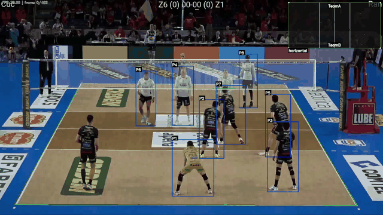

# Volleyball Visual Analysis

This project analyzes volleyball match videos with a lightweight pipeline:

1. run cloud or local object detection for court, players, and ball;
2. track the court and players across frames;
3. reconstruct and segment the ball trajectory;
4. render an overlay video for review and downstream match analysis.

The intended workflow is cloud inference once, then repeated local iteration on tracking, trajectory parameters, and visualization without paying for duplicate inference.

## Current Demo



The current pipeline has been validated on a short sample clip and now combines:

- **Ultralytics Platform** dedicated endpoints for court and player detection.
- **Roboflow** hosted models for ball and action detection.
- Court tracking, net estimation, homography, player ID tracking, ball trajectory reconstruction, and final overlay rendering.

Latest generated review artifacts include:

- `full_overlay.mp4`: final 1920x1080 review overlay.
- `court_tracking.jsonl`: frame-level court corners and net state.
- `players_tracks.jsonl`: stabilized player tracks with stale prediction filtering.
- `ball_trajectory.jsonl` / `ball_trajectory.csv`: reconstructed ball path.
- `ball_path_birdseye.jpg` and `ball_segments_timeline.png`: trajectory review images.

The demo GIF above is a lightweight README preview generated from `full_overlay.mp4`.

## Project Layout

```text
.
├── run_pipeline.py          # CLI entrypoint
├── config/                  # Split YAML configuration
│   ├── main.yaml            # video path, enabled steps, artifact reuse
│   ├── detection.yaml       # backend, model IDs, targets, sampling FPS
│   ├── court.yaml
│   ├── players.yaml
│   ├── trajectory_analysis.yaml
│   └── overlay.yaml
├── detection/               # Roboflow, Ultralytics Platform, and local YOLO backends
├── court/                   # court tracking, homography, net support
├── players/                 # player tracking
├── ball/                    # ball selection, pseudo-3D trajectory, segmentation
├── visualization/           # final video overlay
└── docs/PIPELINE.md         # architecture notes
```

## Install

Use Python 3.10-3.12. The Roboflow `inference-sdk` dependency does not currently support Python 3.13+.

```bash
python3.12 -m venv .venv
source .venv/bin/activate
pip install -e .
```

Cloud API keys are loaded from environment variables. For local development, copy `.env.example` to `.env` and fill in only the keys you need:

```bash
cp .env.example .env
```

The same values can also be exported directly in your shell:

```bash
export ROBOFLOW_API_KEY="..."
export ULTRALYTICS_API_KEY="..."
```

Never commit `.env`; it is already ignored by `.gitignore`.

For local YOLO inference, install the optional dependency and configure weights in `config/detection.yaml`:

```bash
pip install -e ".[local-yolo]"
```

## Quick Start

Edit `config/main.yaml`:

```yaml
global:
  video_path: "input/input.mp4"
  output_dir: "outputs"
  cache_dir: ".cache"
  reuse_artifacts: true
```

Run the full player-and-ball analysis:

```bash
python3 run_pipeline.py
```

Preview the resolved workflow without running inference:

```bash
python3 run_pipeline.py --dry-run
```

Override common experiment settings from the CLI:

```bash
python3 run_pipeline.py --video input/game.mp4 --targets court,players,ball
python3 run_pipeline.py --steps detection,trajectory_analysis,overlay
python3 run_pipeline.py --steps overlay --cache-policy cache_only
```

## Cloud Inference Workflow

The default cloud workflow is intentionally narrow and currently uses a hybrid provider setup:

- `court`: Ultralytics Platform model `volleyball-court-1`.
- `players`: Ultralytics Platform model `volleyball-players-1`.
- `ball`: Roboflow model `volleyball_v2/3`.
- `actions`: Roboflow model `volleyball-actions/4` when explicitly enabled.
- `net`: not configured as a standalone detection target yet; net state is estimated from court-related data where available.

- `config/detection.yaml` defaults to `targets: ["court", "players", "ball"]`.
- `actions` and `net` detection are not run unless explicitly enabled.
- Detection cache directories include backend, model ID, confidence, sampling FPS, and frame cap, so changing model settings does not silently reuse stale frame caches.
- Downstream steps can reuse existing output artifacts when they are only needed as dependencies.

### Ultralytics Platform

Ultralytics is the preferred cloud path for high-impact spatial detections in this project. The court and player targets use per-target backend overrides so they can move to dedicated Ultralytics deployments without forcing ball/action models off Roboflow:

```yaml
detection:
  backend: "roboflow"
  target_backends:
    court: "ultralytics"
    players: "ultralytics"
  models_ultralytics:
    court: "volleyball-court-1"
    players: "volleyball-players-1"
```

Set `ULTRALYTICS_API_KEY` in `.env`; do not commit credentials.

A practical iteration loop:

```bash
# 1. Pay for cloud detections once.
python3 run_pipeline.py --steps detection --targets court,players,ball

# 2. Iterate locally on trajectory and overlay.
python3 run_pipeline.py --steps trajectory_analysis,overlay --cache-policy cache_only

# 3. Re-render overlay only after visual changes.
python3 run_pipeline.py --steps overlay --cache-policy cache_only
```

Outputs are stored under `outputs/<video_name>_<hash>/`. Detection frame caches are stored under `.cache/videos/<video_name>_<hash>/detection/<target>/<signature>/`.

To reproduce the current demo-style full run on a local clip:

```bash
python3 run_pipeline.py \
  --video "input/game.mp4" \
  --steps detection,trajectory_analysis,overlay \
  --targets court,players,ball,actions
```

For faster iteration after detections are cached:

```bash
python3 run_pipeline.py \
  --video "input/game.mp4" \
  --steps court_processing,court_homography,players_tracking,trajectory_analysis,overlay \
  --cache-policy cache_first
```

## Configuration

Use `config/main.yaml` for the run-level switches:

- `global.video_path`: input match video.
- `global.output_dir`: per-video output root.
- `global.cache_dir`: detection cache root.
- `global.reuse_artifacts`: reuse existing dependency outputs when possible.
- `steps.*`: enable the stages you want to run.

Use `config/detection.yaml` for inference behavior:

- `backend`: `roboflow`, `ultralytics`, or `local-yolo`.
- `target_backends`: optional per-target backend overrides, such as running `court` on Ultralytics while keeping other targets on Roboflow.
- `targets`: cloud/local detection targets to run when `steps.detection` is enabled.
- `cache_policy`: `cache_first`, `cache_only`, or `always_infer`.
- `infer_fps`: target-specific sampling rates.
- `models_roboflow` / `models_ultralytics` / `models_yolo`: model IDs or local weight paths.

## Recent Engineering Notes

- Added a requests-based Ultralytics backend that normalizes Platform responses into the existing `predictions` schema.
- Added per-target backend selection so each detection target can use the strongest available provider.
- Hardened Ultralytics networking with endpoint-specific `NO_PROXY` handling, mirroring the existing Roboflow proxy workaround.
- Fixed stale player-track rendering by separating internal track retention from downstream output validity.
- Fixed ball trajectory export so optional height-debug metadata is not required.
- Added `.env.example` for unified cloud-key setup.

## Recommended Next Iteration

Add a small evaluation set before heavy parameter tuning:

- 3-5 short clips that represent common camera angles and rallies;
- a lightweight annotation file for ball positions, player boxes, and touch events;
- a script that writes `metrics.json` after each run.

That closes the loop from "the overlay looks better" to measurable detection and analysis quality.
