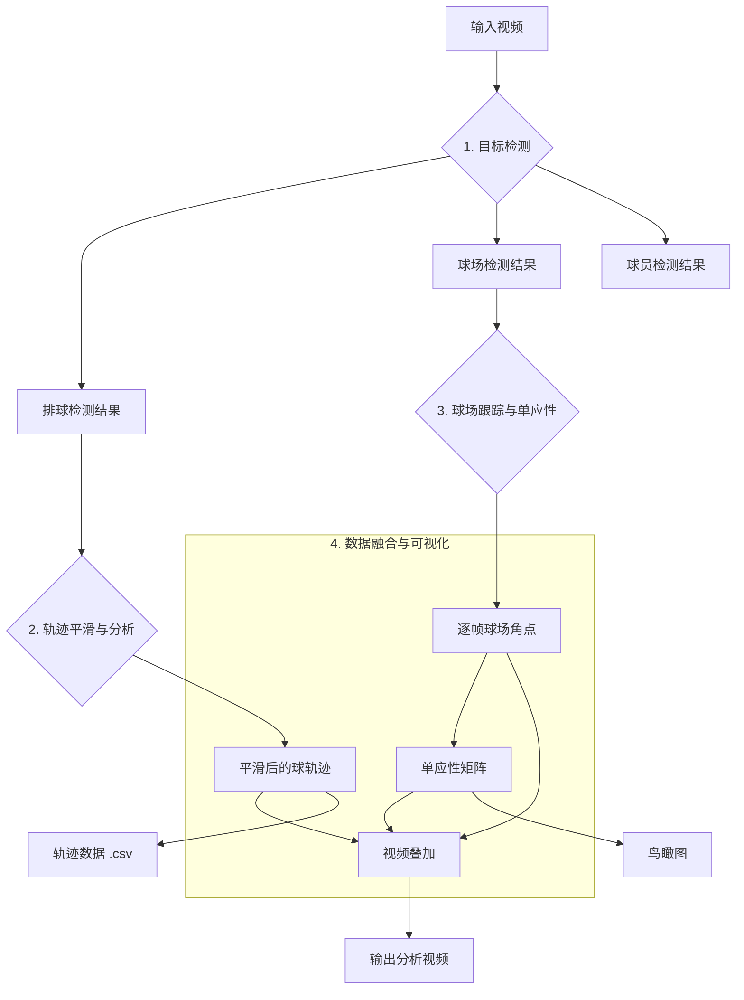

# 🏐 Volleyball Visual Analysis

一个基于计算机视觉的排球视频分析工具集，能够自动完成 **目标检测**、**轨迹跟踪** 和 **战术分析**。

本工具通过 [Roboflow](https://roboflow.com/) 的强大模型进行推理，结合卡尔曼滤波、光流法等多种技术，实现了对排球、球员和球场的高精度分析，并能将结果可视化地叠加到原视频中。

---

## ✨ 核心功能

- **多目标检测与跟踪**:
  - **排球**: 毫秒级精准检测，并利用 Viterbi 算法和卡尔曼滤波生成平滑的运动轨迹。
  - **球场**: 稳定识别球场边界，并通过单应性变换生成鸟瞰图。
  - **球员**: 检测场上所有球员，并可进一步进行号码识别或动作分析。
- **轨迹与物理分析**:
  - 将像素坐标转换为真实的球场坐标（米）。
  - 计算球的速度、加速度等物理量。
- **高度可定制化**:
  - 所有关键参数均可通过 `.env` 文件配置。
  - 模块化设计，方便扩展或替换算法。
- **强大的可视化**:
  - 将检测框、轨迹线、球场边界等信息实时绘制到视频上。
  - 支持生成迷你鸟瞰图，直观展示场上动态。

---

## 🚀 快速上手

只需三步，即可完成一次完整的视频分析。

### 1. 环境准备

```bash
# 克隆项目
git clone https://github.com/your-repo/VolleyballVisualAnalysis.git
cd VolleyballVisualAnalysis

# 创建并激活虚拟环境
python3 -m venv .venv
source .venv/bin/activate

# 安装依赖
pip install -e .
```

### 2. 配置环境

在项目根目录创建一个 `.env` 文件，并填入你的配置信息：

```bash
# 复制模板文件
cp .env.example .env

# 编辑 .env 文件，填入你的 Roboflow API 密钥
nano .env
```

在 `.env` 文件中配置以下关键参数：

```env
# 必需：Roboflow API 密钥
ROBOFLOW_API_KEY="YOUR_ROBOFLOW_API_KEY"

# 输入视频路径（支持相对路径）
VIDEO_PATH="input/input.mp4"

# 输出目录（可自定义）
OUTPUT_DIR="outputs"

# 检测时视频的抽帧率
INFER_FPS=12
```

### 3. 运行完整流程

执行以下命令，一键完成从检测到可视化叠加的全部流程：

```bash
# 1. 球检测
python3 scripts/run_detection.py ball

# 2. 球场检测
python3 scripts/run_detection.py court

# 3. 球场处理与单应性计算
python3 scripts/run_court_processing.py

# 4. 轨迹分析
python3 scripts/run_trajectory_analysis.py

# 5. 视频叠加
python3 scripts/run_overlay.py
```

分析完成后，你将在 `outputs/` 目录下找到最终的叠加视频 `ball_overlay_full.mp4` 以及其他分析数据。

---

## 🎯 快速开始流程详解

### 步骤 1: 球检测
```bash
python3 scripts/run_detection.py ball
```
- **作用**: 使用 Roboflow 模型检测视频中的排球位置
- **输出**: 生成排球检测数据，保存在 `outputs/ball_detections/` 目录
- **文件**: `ball_detections.csv` 包含每帧的排球坐标和置信度

### 步骤 2: 球场检测
```bash
python3 scripts/run_detection.py court
```
- **作用**: 识别排球场的边界线和关键点
- **输出**: 生成球场检测数据，保存在 `outputs/court_detections/` 目录
- **文件**: `court_detections.csv` 包含每帧的球场角点坐标

### 步骤 3: 球场处理与单应性计算
```bash
python3 scripts/run_court_processing.py
```
- **作用**: 对球场检测结果进行平滑处理，计算单应性变换矩阵
- **输出**: 生成处理后的球场数据和变换矩阵
- **文件**: `court_processed.csv` 和 `homography_matrix.pkl`

### 步骤 4: 轨迹分析
```bash
python3 scripts/run_trajectory_analysis.py
```
- **作用**: 将球的像素坐标转换为真实世界坐标，计算速度和加速度
- **输出**: 生成轨迹分析数据
- **文件**: `trajectory_analysis.csv` 包含球的真实位置、速度和加速度

### 步骤 5: 视频叠加
```bash
python3 scripts/run_overlay.py
```
- **作用**: 将所有分析结果可视化地叠加到原视频上
- **输出**: 生成最终的分析视频
- **文件**: `ball_overlay_full.mp4` - 包含所有可视化元素的完整视频

---

## 📊 工作流程

本项目的数据处理流程如下图所示：



---

## 🛠️ 详细用法

### 检测模块 (`scripts/run_detection.py`)

此脚本用于调用 Roboflow模型 对视频进行目标检测。

- **检测排球**:
  ```bash
  python3 scripts/run_detection.py ball
  ```
- **检测球场**:
  ```bash
  python3 scripts/run_detection.py court
  ```
- **检测球员**:
  ```bash
  python3 scripts/run_detection.py players
  ```

#### 跟踪

运行玩家跟踪：

```bash
python3 scripts/run_players_track.py
# 仅处理前 N 帧（调参/验证更快）
python3 scripts/run_players_track.py --max-frames 220
```

预览跟踪结果：

```bash
python3 scripts/preview_players_tracks.py
```

### 分析与处理模块

- **处理球场数据** (平滑、插值):
  ```bash
  python3 scripts/run_court_processing.py
  ```
- **计算单应性并生成鸟瞰图**:
  ```bash
  python3 scripts/run_court_homography.py
  ```
- **分析球的轨迹** (转换为世界坐标):
  ```bash
  python3 scripts/run_trajectory_analysis.py
  ```

### 可视化模块

- **生成最终叠加视频**:
  ```bash
  python3 scripts/run_overlay.py
  ```
- **预览球场跟踪效果**:
  ```bash
  python3 scripts/preview_court_tracking.py
  ```

---

## ⚙️ 主要配置项

通过修改根目录的 `.env` 文件，你可以调整项目的各项参数。所有路径都支持相对路径和绝对路径。

### 基础配置

| 变量名 | 描述 | 默认值 |
| :--- | :--- | :--- |
| `ROBOFLOW_API_KEY` | **必需**，你的 Roboflow API 密钥 | `None` |
| `VIDEO_PATH` | 输入视频的路径（支持相对路径） | `input/input.mp4` |
| `OUTPUT_DIR` | 输出目录（支持相对路径） | `outputs` |
| `INFER_FPS` | 检测时视频的抽帧率 | `12` |

### 检测配置

| 变量名 | 描述 | 默认值 |
| :--- | :--- | :--- |
| `BALL_MODEL_ID` | 排球检测模型ID | `volleyball-detection/1` |
| `COURT_MODEL_ID` | 球场检测模型ID | `volleyball-court/1` |
| `PLAYERS_MODEL_ID` | 球员检测模型ID | `volleyball-players/1` |
| `BALL_MIN_CONF` | 排球检测最小置信度 | `0.3` |
| `COURT_MIN_CONF` | 球场检测最小置信度 | `0.3` |
| `PLAYERS_MIN_CONF` | 球员检测最小置信度 | `0.3` |

### 可视化配置

| 变量名 | 描述 | 默认值 |
| :--- | :--- | :--- |
| `OVERLAY_MIN_CONF` | 叠加时显示的最小置信度 | `0.1` |
| `COURT_OVERLAY` | 是否在视频中叠加球场 | `True` |
| `COURT_MINI_ENABLE`| 是否启用迷你鸟瞰图 | `True` |
| `ACTIONS_SHOW_BOX` | 是否显示动作检测框 | `True` |
| `COURT_MINI_SHOW_TEAMS` | 迷你鸟瞰图是否显示队伍名称 | `True` |
| `TRAJECTORY_SHOW_LINE` | 是否显示轨迹线 | `True` |
| `TRAJECTORY_SHOW_POINTS` | 是否显示轨迹点 | `True` |

### 高级配置

| 变量名 | 描述 | 默认值 |
| :--- | :--- | :--- |
| `KALMAN_PROCESS_NOISE` | 卡尔曼滤波过程噪声 | `0.1` |
| `KALMAN_MEASUREMENT_NOISE` | 卡尔曼滤波测量噪声 | `0.1` |
| `SMOOTHING_WINDOW_SIZE` | 轨迹平滑窗口大小 | `5` |
| `HOMOGRAPHY_METHOD` | 单应性计算方法 | `ransac` |
| `MAX_FRAMES` | 最大处理帧数（用于调试） | `None` |

### 环境变量示例

```env
# 基础配置
ROBOFLOW_API_KEY="your_api_key_here"
VIDEO_PATH="input/input.mp4"
OUTPUT_DIR="outputs"
INFER_FPS=12

# 检测配置
BALL_MODEL_ID="volleyball-detection/1"
COURT_MODEL_ID="volleyball-court/1"
PLAYERS_MODEL_ID="volleyball-players/1"
BALL_MIN_CONF=0.3
COURT_MIN_CONF=0.3
PLAYERS_MIN_CONF=0.3

# 可视化配置
OVERLAY_MIN_CONF=0.1
COURT_OVERLAY=True
COURT_MINI_ENABLE=True
ACTIONS_SHOW_BOX=True
COURT_MINI_SHOW_TEAMS=True
TRAJECTORY_SHOW_LINE=True
TRAJECTORY_SHOW_POINTS=True

# 高级配置
KALMAN_PROCESS_NOISE=0.1
KALMAN_MEASUREMENT_NOISE=0.1
SMOOTHING_WINDOW_SIZE=5
HOMOGRAPHY_METHOD=ransac
MAX_FRAMES=None
```

---

## 🏗️ 代码架构与最佳实践

### 模块化设计

本项目采用模块化设计，每个模块都有明确的职责和接口：

1. **核心模块** (`core/`)
   - 提供基础工具类和通用功能
   - 包含 Roboflow 客户端、类型定义等
   - 为其他模块提供统一的接口

2. **检测模块** (`ball/`, `court/`, `players/`)
   - 各自负责特定目标的检测和跟踪
   - 使用统一的管线模式
   - 支持模型替换和参数调整

3. **分析模块** (`analysis/`)
   - 提供轨迹分析、平滑滤波等算法
   - 支持多种分析方法的组合
   - 可扩展的分析框架

4. **可视化模块** (`visualization/`)
   - 负责将分析结果可视化
   - 支持多种可视化效果
   - 可定制的显示样式

### 代码规范

- **命名规范**：
  - 函数名使用小写字母和下划线：`run_detection`
  - 类名使用驼峰命名法：`RoboflowClient`
  - 常量使用大写字母和下划线：`MAX_FRAMES`

- **文档规范**：
  - 所有公共函数和类都有详细的文档字符串
  - 使用 Google 风格的文档格式
  - 包含参数说明、返回值和示例

- **错误处理**：
  - 使用明确的异常类型
  - 提供有意义的错误信息
  - 适当的日志记录

### 扩展指南

#### 添加新的检测模型

1. 在 `config/` 目录下创建新的配置文件
2. 在 `core/` 目录下实现模型客户端
3. 在 `scripts/` 目录下创建运行脚本
4. 更新 `README.md` 中的文档

#### 添加新的分析算法

1. 在 `analysis/` 目录下实现算法
2. 确保算法符合统一的接口规范
3. 添加单元测试
4. 更新文档和示例

#### 自定义可视化效果

1. 在 `visualization/` 目录下创建新的可视化类
2. 继承基础可视化类
3. 实现自定义的绘制方法
4. 在配置文件中添加相关参数

### 性能优化

- **批处理**：使用批处理提高检测效率
- **缓存**：合理使用缓存减少重复计算
- **并行处理**：对独立任务使用并行处理
- **内存管理**：及时释放不再需要的数据

### 调试与测试

- **日志记录**：使用 Python 的 logging 模块记录关键信息
- **断言检查**：在关键位置添加断言检查
- **单元测试**：为核心功能编写单元测试
- **可视化调试**：使用预览脚本进行可视化调试

---

## 📁 项目结构

```
.
├── actions/              # 动作分析模块
│   ├── clips.py         # 动作片段生成
│   └── io.py            # 动作数据输入输出
├── analysis/             # 轨迹平滑、滤波等核心分析算法
│   ├── kalman.py        # 卡尔曼滤波器
│   ├── kinematic_filter.py # 运动学滤波
│   ├── smoothing.py     # 轨迹平滑算法
│   └── trajectory.py    # 轨迹分析
├── ball/                 # 排球检测与轨迹构建管线
│   ├── __init__.py      # 模块初始化
│   └── pipeline.py      # 排球检测管线
├── config/               # 项目配置文件加载
│   ├── actions.py       # 动作分析配置
│   ├── ball.py          # 排球检测配置
│   ├── common.py        # 通用配置
│   ├── court.py         # 球场检测配置
│   ├── players.py       # 球员检测配置
│   └── teams.py         # 球队配置
├── core/                 # 核心工具类
│   ├── __init__.py      # 模块初始化
│   ├── pipeline.py      # 通用管线基类
│   ├── roboflow_client.py # Roboflow API 客户端
│   ├── types.py         # 自定义数据类型
│   └── utils.py         # 通用工具函数
├── court/                # 球场检测、跟踪与单应性计算
│   ├── config.py        # 球场配置
│   ├── detect.py        # 球场检测
│   ├── homography.py    # 单应性变换计算
│   ├── io.py            # 球场数据输入输出
│   ├── orientation.py   # 球场方向分析
│   ├── processing.py    # 球场数据处理
│   ├── smoothing.py     # 球场数据平滑
│   ├── tracker.py       # 球场跟踪
│   └── utils.py         # 球场工具函数
├── decision/             # 决策模块
│   ├── court_binding.py # 球场绑定分析
│   ├── cross_validate.py # 交叉验证
│   └── state_machine.py # 状态机
├── input/                # 输入数据目录
│   ├── input.mp4        # 示例输入视频
│   ├── input.png        # 示例输入图片
│   ├── input2.mp4       # 备用输入视频
│   └── input2.png       # 备用输入图片
├── players/              # 球员检测与跟踪
│   ├── io.py            # 球员数据输入输出
│   ├── reid_embedder.py # 球员重识别嵌入
│   ├── track.py         # 球员跟踪
│   └── tracker.py       # 球员跟踪器
├── scripts/              # 可执行脚本（流程入口）
│   ├── build_action_clips.py # 构建动作片段
│   ├── make_video_preview.py # 生成视频预览
│   ├── preview_actions.py    # 预览动作分析
│   ├── preview_court_detections.py # 预览球场检测
│   ├── preview_court_tracking.py # 预览球场跟踪
│   ├── preview_players_tracks.py # 预览球员跟踪
│   ├── preview_players.py # 预览球员检测
│   ├── run_court_detect.py # 运行球场检测
│   ├── run_court_homography.py # 运行球场单应性
│   ├── run_court_processing.py # 运行球场处理
│   ├── run_detection.py  # 运行目标检测
│   ├── run_overlay.py     # 运行视频叠加
│   ├── run_players_track.py # 运行球员跟踪
│   └── run_trajectory_analysis.py # 运行轨迹分析
├── visualization/         # 可视化与视频叠加
│   ├── action_hud.py     # 动作HUD显示
│   ├── court_overlay.py # 球场叠加
│   ├── hud.py           # HUD显示
│   ├── mini_birdseye.py # 迷你鸟瞰图
│   ├── overlay_utils.py # 叠加工具
│   └── overlay.py       # 视频叠加
├── weights/              # 模型权重目录
└── outputs/             # 所有输出结果的存放目录
    ├── ball_detections/ # 排球检测结果
    ├── court_detections/ # 球场检测结果
    ├── player_detections/ # 球员检测结果
    ├── trajectory_analysis/ # 轨迹分析结果
    └── overlays/        # 叠加视频结果
```
